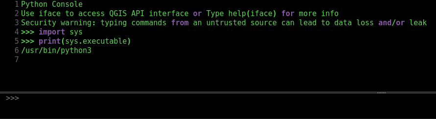

Every so often, I get the goofy idea in my head that I'm going to try to do
something interesting with GIS. I'm not sure why, but I suppose it's just one of
those difficult-to-explain urges we all get from time to time. No? Just me? Ok
then.


## The Problem

My goal with this particular flight of whimsy is to try my hand at making some
nifty-looking 3D maps with the aid of [QGIS](https://qgis.org/en/site/), an
open-source GIS software.

In this case, I'm looking to create 3D terrain maps of some public parks in the
area. To accomplish this, I'm going to need DEM (Digital Elevation Model) data,
as well as some shapefiles of the parks in question. I will use these to "cut out"
park-shaped chunks from the DEM data. The latter is easy enough to acquire from
the county's data repository on their website. As for the DEM data, there are
some libraries available in some programming languages for retrieving this
information programmatically.

It is possible to do all of this through the QGIS GUI. There are other sources
from which DEM data can be retrieved that don't require programming. However, I
would like to process this data for all 70+ shapefiles that I have. Clearly,
automating some of this is going to save me considerable time. As a bonus, I can
reuse the script(s) for similar jobs in the future.


## So Why These Tools?

Yeah, section header, why did I pick these tools? Python does have perfectly
good spatial data tools available to it and even has a nifty library for retrieving
DEM data from the Internet, the `elevation` package. The thing is, R also has
some really good spatial data tools and an easier-to-use library for retrieving
DEM data in `elevatr`. Of course, I could have gone really nuts and just used
vanilla python and the QGIS API for accomplishing this. Actually, I did attempt
that first, with the resulting script below:

```python
import os
import re
import elevation
import processing

from osgeo import gdal
from qgis.core import QgsRasterLayer


def get_bounding_box(lyr):
    lyr.selectAll()
    return lyr.boundingBoxOfSelected()

def mask_dem_for_extent(lyr, dem_lyr, output_dir):
    # Get the output file name
    lyr_name = re.sub(r'[ /()]', '_', lyr.name()).replace('\'', '').lower()

    # Clip it! Clip it good!
    parameters = {
        'INPUT': dem_lyr,
        'MASK': lyr.name(),
        'TARGET_CRS': 'EPSG:3857',
        'NODATA': -9999,
        'ALPHA_BAND': False,
        'CROP_TO_CUTLINE': True,
        'KEEP_RESOLUTION': True,
        'OPTIONS': None,
        'DATA_TYPE': 0,
        'MULTITHREADING': True,
        'OUTPUT': os.path.join(os.path.abspath(output_dir), 'clipped', lyr_name + '.tif')
    }

    # Run the algorithm!
    processing.runAndLoadResults('gdal:cliprasterbymasklayer', parameters)


# Build the list of layers and extract the base layer for DEM
base_lst = [layer for layer in QgsProject.instance().mapLayers().values()]

# Retrieve county vector layer from layer list
base_lyr = list(filter(lambda x: x.name() == 'CountyName1', base_lst))[0]

# Gather remaining layers in a list
layer_lst = [layer for layer in QgsProject.instance().mapLayers().values() if layer.name() not in ('CountyName1', 'CountyName2')]     # Variations of the same county name in iface

# Get the DEM to cut from
bbox = get_bounding_box(base_lyr)
bbox_bounds = (bbox.xMinimum(), bbox.yMinimum(), bbox.xMaximum(), bbox.yMaximum())
output_file = '/path/to/county/dem/county.tif'
elevation.clip(bounds=bbox_bounds, output=output_file, product='SRTM3')

# Load the warped raster
input_raster = QgsRasterLayer(output_file, 'raster')

# Process!
for lyr in layer_lst:
    mask_dem_for_extent(lyr, input_raster, os.path.abspath('./dems'))
```

This seemed to work for the most part, but I did run into some CRS issues, all
but certainly my fault. Getting your CRS straight can be tricky! It's easily been
perhaps the biggest challenge I've had messing around with spatial data. The part
that's really doing the important work here is the `cliprasterbymasklayer` tool
from GDAL. With the aid of some rather extensive documentation and the kind folks
at [GIS StackExchange](https://gis.stackexchange.com/), it wasn't too difficult
to figure out. Before clipping, of course, I needed to define a bounding box of the
area that I wanted to get a DEM for and then retrieve that DEM with `elevation`.
This wasn't too difficult, as I was able to access the county layer, represented
as a polygon, and request the bounding box, which is available through a method
on the `QgsVectorLayer` object.

Any of these approaches would have done fine, but I'm more familiar
with R's tools for this kind of task and find some of them to be a bit less
cumbersome to use. I was able make quick work of things with the `sf` and `raster`
libraries, as well as the aforementioned `elevatr`. On top of that, I really just
wanted to see if I could access R from QGIS and make everything work together
smoothly. I also thought that it would be a good chance to start getting familiar
with `rpy2`. It was! In short, it lets you run R code from python. You can read
more about it [here](https://rpy2.github.io/doc/latest/html/getting-started.html).

I'll explain more about what I did with running R from python in a moment, but
first I'd like to share the R script that I wrote to handle DEM processing when
I got frustrated with my original python/QGIS solution.

```r
library(sf)
library(raster)
library(elevatr)
library(purrr)
library(stringr)


# Get the base DEM
county <- st_read("../county/County.shp")
county_elev <- get_elev_raster(county, z = 9)
county_mask <- mask(county_elev, county)

# Get shapefiles for all the parks in a list
park_shp <- list.files("park_layers", "\\.shp")

# Cut out the DEM pieces with shapefile masks as cookie cutters
#   1. Ensure pathname is accurate
#   2. Open shapefile and cut out a piece with mask
#   3. Write the cutout mask raster to a file in dems/clipped
cut_dem <- function(park_file, dough) {
  park_name_raster <- str_replace(park_file, ".shp", ".tif")
  park_name <- paste("park_layers", park_file, sep = "/")
  park_obj <- st_read(park_name)
  dem_piece <- raster::mask(dough,
                            park_obj,
                            filename = paste("dems/clipped", park_name_raster, sep = "/"))
}

purrr::map(park_shp, ~ cut_dem(park_file = ., dough = county_mask))
```

I already prefer this to the first attempt python solution, if only because it is
cleaner and more concise. On an unrelated note, "dough" seems like a bit of a
confusing variable name. I  was kinda thinking "cookie dough" when I came up with
it, because we're sort of cutting out "cookies" from the DEM "dough", right? No?
Okay...

First, we load the necessary spatial libraries, as well as `purrr` (functional
programming tools) and `stringr` (string manipulation) from the [tidyverse](https://www.tidyverse.org/) collection of packages.
String manipulation is one area where I definitely prefer the tools built in to
python, though `stringr` does make string manipulation in R much less painful
than trying to handle strings in base R.

The rest of the script is mostly straightforward. We read the county shapefile,
retrieve the DEM raster with `elevatr`, which apparently works out boundaries and
everything on its own. In this script, I have the zoom value (z) set to nine. I
thought that this offered a decent compromise between detail and performance, but
ended up bumping it up to the max value of 14 in the final version. I like the detail
in level 14, but it does take much longer to download and process rasters and
produces _much_ larger files. If memory and/or speed are concerns, and you don't
need the highest levels of detail, then lower values are recommended.

The `cut_dem` function is the star of the show here. After some prep work setting
up file names for how to name the raster files, we use the `raster::mask` function
to do the clipping. This is functionally equivalent to the `cliprasterbymasklayer`
algorithm in the first script. This is much simpler to use, though. The `dough`
parameter is just what I chose to call the variable representing the county DEM.
No particular reason, but I thought of this operation as cutting park shapes out
of the DEM like cookie cutters in cookie dough. Variable naming is tricky. It's easily been
perhaps the biggest challenge I've had messing around with ~~spatial data~~ programming.

Finally, we use `purrr`'s `map` function, which works similarly to how python's
built-in `map` function works. To pass more than one parameter to the function,
it was necessary to use R's formula notation. The "." simply indicates that I'm
passing the aforementioned `park_shp` variable in as the first parameter. R formulas
are pretty nifty once you get your head wrapped around them.

## Putting Everything Together to do the Thing I Said I Was Going to Do

Yeah, about that. Thanks, section header. Once again you remind me of the thing
that I was about to write about. But yeah, let's get on with it!

So the first part to making this work is to get `rpy2` installed in the version
of python that QGIS is using. Actually, the first part is to install QGIS and R,
but for our purposes, I'm assuming you've done that already. In any case, to find
the python interpreter used by QGIS, you can simply import the `sys` library
(`import sys`), and then print the executable path (`print(sys.executable)`).



Once you have that, you can install `rpy2` like so:
`/usr/bin/python3 -m pip install rpy2`

Naturally, you will want to replace `/usr/bin/python3` with the path to your
python interpreter.

From what I've gathered to this point working with `rpy2`, you can run R code
one of two ways. There might be more, but I haven't gotten that deep into it at
this point. One way is to write some R code into a string in python and execute it
with a method from there. I imagine this most comes in handy for quick one-liners
or short functions, but you might not otherwise require a ton of R. The second way,
which I've employed in the following code, is to import R packages into python
variables, after which, you can use the R libraries as though they were python
libraries! In other words, you can invoke R libraries with python syntax! Check
it out below:

```python
import os
import rpy2.robjects.packages as rpackages


# Import the R packages
sf = rpackages.importr('sf')
raster = rpackages.importr('raster')
elevatr = rpackages.importr('elevatr')

# Get the base DEM
base_lst = [layer for layer in QgsProject.instance().mapLayers().values()]
county = list(filter(lambda x: x.name() == 'County', base_lst))[0]
county_elev = elevatr.get_elev_raster(county, z=14)      # Zoom level 14
county_mask = raster.mask(county_elev, county)

# List of park shapefiles
park_shp = [layer for layer in QgsProject.instance().mapLayers().values()
            if layer.name() != 'County']

def cut_dem(park_file, dough):
    """
    'Cut' DEM cookie-cutter style with park shapefiles
    """
    park_name_raster = park_file.replace('.shp', '.tif')
    park_name = 'park_layers/' + park_file
    park_obj = sf.st_read(park_name)
    raster.mask(dough, park_obj,
                filename='dems/clipped/' + park_name_raster,
                overwrite=True)


for pfile in park_shp:
    cut_dem(pfile, county_mask)
```

It looks strikingly similar to the R script, no? There are the extra steps of
importing the R libraries into python variables. There's also the very important
difference of reading layers from the interface with the QGIS API, instead of reading
them from files. Also, instead of `stringr`, I used python's built-in string manipulation tools. I also brought in list comprehensions and a `for` loop. For what it's worth, R has `for` loops as well, but I prefer the functional tools. I could have done it differently in this python script as well, but a good ol'-fashioned `for` loop gets the trick done here.

### Pros and cons

I think I've gushed quite a bit about some of the advantages here of using python
with `rpy2`, but there allow me to enumerate some of the advantages here:

1. Interfaces nicely with QGIS for the most part. It's just like writing any other python code in the console, after all!
2. I can use the R tools that I prefer in python. Take advantage of the best of both worlds in the same script!
3. I can take advantage of the easier/better string processing in python. Yup.
4. Shorter, cleaner script (as opposed to my first pass python version).

For all the good though, there was one glaring disadvantage, or at least somewhat
of an issue that I was unable to work around in this experiment. As nice as it is
to take layers straight from the QGIS interface and process them here, it's still
necessary to write the clipped rasters to files and then read them back into QGIS,
either through the GUI or through straight python. This is because the results of
the R operations return S4 objects in R. In working with this to date, I am not yet
aware of how, or even if it's possible, to convert these to python objects, much
less to objects of type `QgsRasterLayer`. Still, I feel like this ended up being
pretty nifty. Just one more way to approach the problem outlined here.
