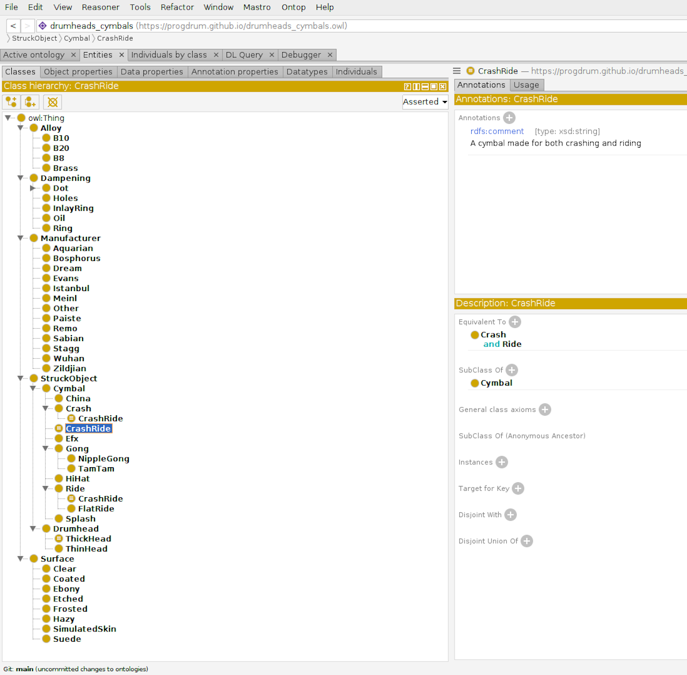
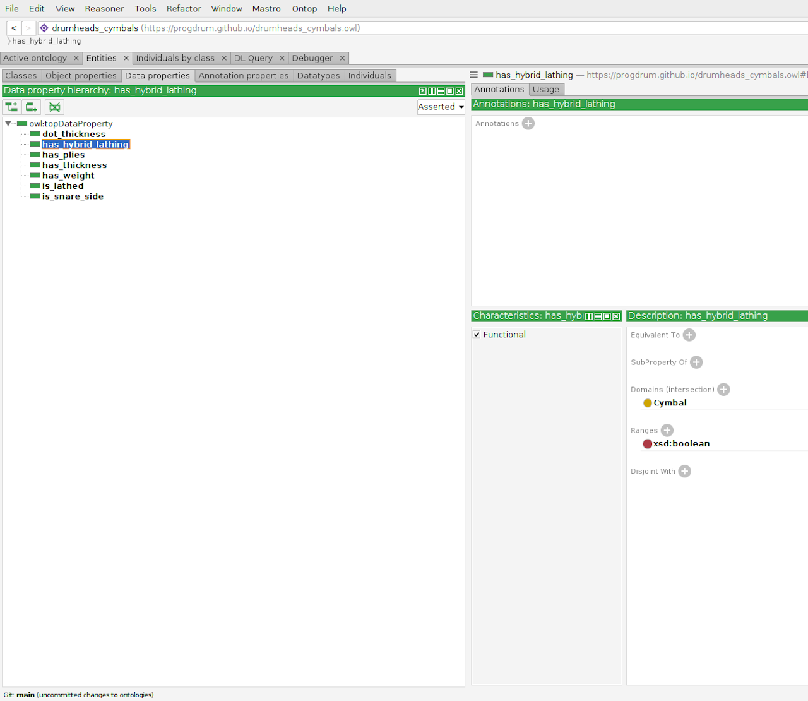
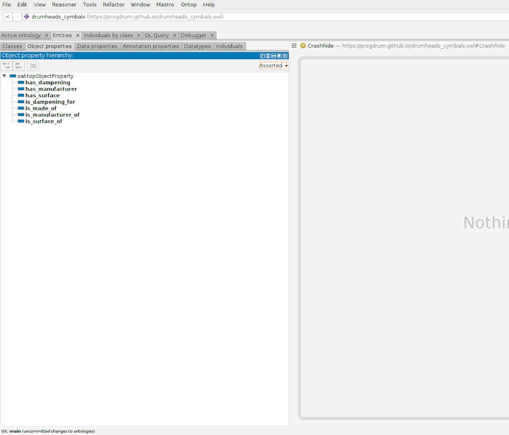
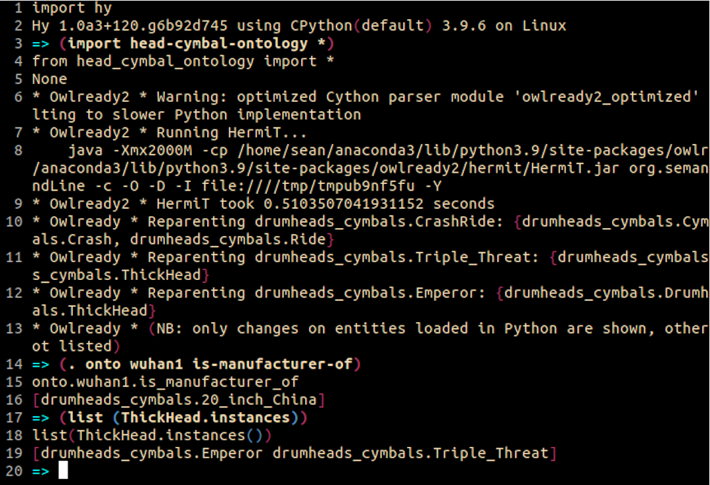

That's right, I've gotten the obligatory Hy/Hi pun out of the way, right in the title.
If you're not familiar with one or the other or both of these, I'll sum them up briefly.

[Hy](https://github.com/hylang/hy) is a dialect of Lisp that is essentially Python
under the hood. It is fully interoperable with Python, giving you the power of Python's
ecosystem with the fun of parentheses! It is more or less to Python what Clojure is to Java.
I have grossly oversimplified this, but that should give you a rough idea. It is under active development and, as of this writing, they are approaching a version 1 release. Check out that
link to see their GitHub repository and to learn more.

[OWL](https://www.w3.org/TR/owl-guide), or Web Ontology Language (talk about forced acronyms!)
is a means of representing knowledge on the web. That hardly begins to scratch the
surface. It employs XML and RDF (Resource Description Framework) for representing
knowledge and description logics for inferring new knowledge. It's part of the broader
world of the [Semantic Web](https://www.w3.org/standards/semanticweb/).

## Building An Ontology

In what follows, I want to give a brief overview of building an OWL ontology programmatically,
using Hy and the Python library [Owlready2](https://owlready2.readthedocs.io/en/latest/),
written by Lamy Jean-Baptiste. As a side note, I would recommend his book about this,
titled [Ontologies with Python](https://www.apress.com/gp/book/9781484265512). I found it
rather handy in getting me up to speed.

### Representing the Knowledge of Hitting Things

Over the course of this summer now past, I've been spending a lot of time researching
drum heads and cymbals in an attempt to make an informed decision with regards to
what I wanted to replace these parts on my drum set with. This coincided with me giving
a lot of thought to ontologies and knowledge graphs and how I might Itbuild them. As it
happens, the constellation of drum head and cymbal types makes for a rather good domain
to model in OWL, so I've done just that.

Aside from being personally interesting to me, I feel this was a good domain to work with
because of the variety of hierarchical as well as compositional relationships. Also, who
knows, it could serve as part of a handy decision-making system some day.

## Getting Down to Business (and Macros)

So...the first thing that I wanted to do with this program was to establish a means of
easily and conveniently specifying new entities for my ontology. These entities represent
the "things" that the ontology is about. In our case here, this includes base classes for
drum heads and cymbals, as well as types of cymbals, and various aspects of both drum heads
and cymbals, such as materials, surfaces, etc.

With Owlready2, you simply define each entity as a class, which you can then set attributes
and define equivalency relations and whatnot. You can also use these class/entity names
when specifying the domains and ranges of various properties.

Of course, that's all super cool, but there was a bit of me concerned that some of these
entity definitions could get a bit messy and a bit difficult to follow, especially if this
ontology got large. I also wanted to make clear in the code where I was specifying an
entity definition and not any other kind of class. How to do that? Well, Hy, like any
good Lisp, features a sophisticated macro system, which allows to create new syntax.
With the `defmacro` macro (much of the language itself is defined as macros), you can specify
a transformation that will take parameters and turn them into maenaingful code prior to runtime. These parameters can include placeholders for lines of code, which in this case are
passed as data to be transformed into code. Gotta love that homoiconicity!

In short, I've taken advantage of this functionality to define my own new bit of syntax
explicitly for defining OWL entities in Owlready2. I won't go into the code in too much detail.
For more information, I recommend checking out the [Hy documentation](https://docs.hylang.org/en/master/index.html).

```{clojure}
(defn get-default [dictionary key [default None]]
    "Like `get`, but with a default if key is not present."
    (try
      (get dictionary key)
      (except [KeyError]
        default)))

;; Macro for defining entities with all options in one command
(defmacro defentity [ent-name parent [attributes {}]]
  (import hy.models [Symbol])
  `(defclass ~(Symbol ent-name) [~(Symbol parent)]
     (setv equivalent-to (get-default ~attributes ':equivalent-to None)
           label (get-default ~attributes ':label [])
           comment (get-default ~attributes ':comments [])
           seeAlso (get-default ~attributes ':see-also [])
           versionInfo (get-default ~attributes ':version-info [])
           deprecated (get-default ~attributes ':is-deprecated [])
           incompatibleWith (get-default ~attributes ':incompatible-with [])
           backwardCompatibleWith (get-default ~attributes ':backward-compatible-with [])
           isDefinedBy (get-default ~attributes ':is-defined-by []))))
```

As you can see in this code snippet, I first define a helper function that the macro
takes advantage of. This function just returns a default value in the event that a particular
dictionary key is not present. Basically, I'm just taking the standard class definition
macro and inserting the entity name and its parent as Hy Symbols, which are the datatype
expected at those points in the class definition. Similarly, the `defentity` after the
`defmacro` symbol at the beginning of this list is itself a symbol.

Everything after the backtick (\`) is not evaluated at runtime, but rather is the portion that will be transformed prior to runtime. The tildes (~) specify expressions to be evaluated at this time, in this case, transforming the `ent-name` and `parent` (passed as strings) into Symbols, as well as inserting the `attributes` dictionary in those `get-default` expressions.
That first item, `equivalent-to`, specifies a clause or series of clauses using other entities and properties, as well as logical connectives, to specify an expression that is the
same as that class. This could be handy later when running the reasoner, where certain objects matching those criteria might be found to be equivalent to certain entities and be
identified as such by the reasoner. The remainder of the items are different annotations
supported by OWL. These attributes do not represent an exhaustive list of the things that can
be accomplished when defining entities, but they work for our purposes here.

Before proceeding further, I would like to note that the full code (including the generated
`.owl` file) is available [here](https://github.com/progdrum/ontology_stuff/tree/main/drumheads_cymbals).

## Actually Defining the Entity

So now that that boilerplate is set up, we can see some of this stuff in action.
Below is a simple entity definition using the `defentity` macro.

```{clojure}
(defentity "Drumhead" "Thing"
    {:comments ["Generic drumhead class"]
     :version-info ["0.1"]})
```

Nothing too wild going on here. Just creating an entity called "Drumhead", with a
comment and some basic version info. Annotations in Owlready2 are specified as lists.
There can be more than one item in the list for each of these. "Thing" is OWL's top-level
entity that entities with no user-defined parents inherit from.

The above form in Hy, when expanded (the transformation of a macro with parameters into
runnable code), would look something like the following:

```{clojure}
(defclass Drumhead [Thing]
   (setv equivalent-to (get-default {:comments ["Generic drumhead class"]
                                     :version-info ["0.1"]} ':equivalent-to None)
         label (get-default {:comments ["Generic drumhead class"]
                             :version-info ["0.1"]} ':label [])
         comment (get-default {:comments ["Generic drumhead class"]
                               :version-info ["0.1"]} ':comments [])
         seeAlso (get-default {:comments ["Generic drumhead class"]
                               :version-info ["0.1"]} ':see-also [])
         versionInfo (get-default {:comments ["Generic drumhead class"]
                                   :version-info ["0.1"]} ':version-info [])
         deprecated (get-default {:comments ["Generic drumhead class"]
                                  :version-info ["0.1"]} ':is-deprecated [])
         incompatibleWith (get-default {:comments ["Generic drumhead class"]
                                        :version-info ["0.1"]} ':incompatible-with [])
         backwardCompatibleWith (get-default {:comments ["Generic drumhead class"]
                                              :version-info ["0.1"]}
                                              ':backward-compatible-with [])
         isDefinedBy (get-default {:comments ["Generic drumhead class"]
                                   :version-info ["0.1"]} ':is-defined-by []))))
```

It's a bit cumbersome to be sure. I'll be able to clean this up a bit more once Hy macros
support unpack mapping (** operator in Python). The shorthand syntax of the macro is quite handy here, all the same. We wouldn't have to write all of this out for each entity, just the parts that we're using, but defining the macro as I have allows it to be general purpose.

## Ontology Design Decisions

That's enough about the wonders of Hy and macros for now. Let's take a second to discuss
design decisions regarding the ontology itself. Basically, any noun connected to these
items that I could think of became an entity. This includes the kind of drum head surface
(Surface), the number of plies it has (Plies, which itself is involved in a number of
thickness-related properties), etc. It's the same with cymbals.

While many of these could have been specified as properties of the entities, I opted
for entities to better demonstrate and enrich relationships in the ontology. Indeed, with
some of these items, using `equivalent-to` relationships and other means, the reasoner
might be better able to make meaningful inferences. In short, it facilitates knowledge
discovery in the ontology.

## Checking Things Out in Protégé

[Protégé](https://protege.stanford.edu/) is an ontology editor developed at Stanford
University's Center for Biomedical Informatics Research. It can be used directly for editing
OWL ontologies, or, as I've used it here, for checking what the code has produced.
Aside from getting a better visualization of your ontology, this can be a handy debugging
tool as well.

Check out the images from Protégé below and compare them against the code.







## The Reasoner

Yeah, that thing. I've mentioned the reasoner a number of times in this article, but haven't
gotten into any more details about what it does or why. That ends here. "The reasoner" is
actually a collection of reasoners, only one of which can be run at any time. The default
in Owlready2 is [HermiT](http://www.hermit-reasoner.com/). The [Pellet](https://www.w3.org/2001/sw/wiki/Pellet) reasoner is also available. Different reasoners offer different advantages and disadvantages.

What the reasoner does is to take the ontology as defined and make inferences about it.
These inferences can take many forms, including making explicit relationships that were
not defined, but are implied by how the ontology is set up, Re-parenting entities under
other entities if they've been determined to be a subtype of that entity, classifying
individuals (see OWL docs) as certain types of entities based on properties they possess,
and more.

The reason the reasoner can do this is because OWL, or rather, the family of OWL languages
(see section 1.1 in the linked OWL documentation above) are similar to description logics that lend themselves to automated reasoning. It's [Good Ol'-Fashioned AI (GOFAI)](https://en.wikipedia.org/wiki/Symbolic_artificial_intelligence)!

We can get a quick look at what the HermiT reasoner gives us for this ontology. It's not
very large or complex, so probably not a lot.



Indeed, there isn't much to see here in the logs, except to show a couple of the head test
instances defined in the code are getting reclassified as thick heads and `CrashRide` cymbals
are being appropriately classed as both `Crash` and `Ride` cymbals. In the test code, I asked
the reasoner to also infer things about the property values. In this case, that would be things
like what kind of surface does a head have or whether or not a cymbal has a certain kind of
lathing. These things do not come out in the logs, but the inferences are made all the same.
You can see this in the example code above, where I can look for certain properties, like what
cymbal is manufactured by the Wuhan company, or what heads are thick heads. All of these kinds
of properties can be accessed by simple function calls or attribute retrieval.

You may ask though, what is the deal with `wuhan1` in that example? What is that? Allow me
to explain.

```{clojure}
(setv meinl-byzance-dark-ride (Cymbal
                                "Byzance_Dark_Ride"
                                :is-made-of (B20)
                                :has-weight "Medium_Thin"
                                :is-lathed [False]
                                :has-manufacturer (Meinl))
      wuhan-large-china (Cymbal
                          "20_inch_China"
                          :is-made-of (B20)
                          :has-weight "Thin"
                          :is-lathed [True]
                          :has-manufacturer (Wuhan)))
```

In the code snippet above, which is in the example code, you can see that I define a couple of
different `Cymbal` instances. In the example in the previous image, You can see that the
`wuhan-large-china` is the instance that we're referring to. Note that, in this definition,
the `:is-made-of` and `:has-manufacturer` properties are both instantiating instances of the `B20` and `Wuhan` objects as well! Owlready2 automatically labels these instances according to
their class name (`B20` and `Wuhan`, respectively) in lower case, and appends a number to the
end in the order that they were created. In that case, that leaves us with `b201` and `wuhan1`.
It's the instances that we need to refer to when retrieving attributes. If we're looking for the
instances of a class, as with `ThickHead` in the previous image, then we simply invoke the
`instances()` class method.

## Further Work

The ontology presented here is a very simple one. My goal here was to simply get accustomed
to using the tools for developing an ontology programmatically. I'm hoping that this might
help you, as well.

There is so much more that can be added here that I've barely begun to touch on, and so many
more things that I haven't. From the Hy side, there is room for more macros, perhaps, that
could help us to tighten up the syntax and reuse in other ontologies. The last code example
where `Cymbal` instances are defined is one possibility. From the ontology standpoint, there are
far more properties and entities that might be added and linking to a database with instances.
There are also SWRL rules, which I haven't touched on at all here, that can be added to enrich
the ontology with further semantic information.

Fine, you may say, but what is this all good for? Naturally, only your imagination will limit the
possibilities for ontology development and ontology-driven applications. I won't go on to begin
listing the innumerable existing ontologies, such as the [Gene Ontology](http://geneontology.org/). I'll leave that to your web searching skills. In this particular instance, this could serve as
the start of an ontology to back a decision support system for drummers looking to pick out new
drum heads and cymbals to fit their needs. Coupled with more instances of drum heads and cymbals
and accessed through a web app or some such interface, such a thing could potentially prove a
valuable tool to drummers.

I look forward to further experimenting with ontologies and posting here with the occasional
interesting thing. Stay tuned!
